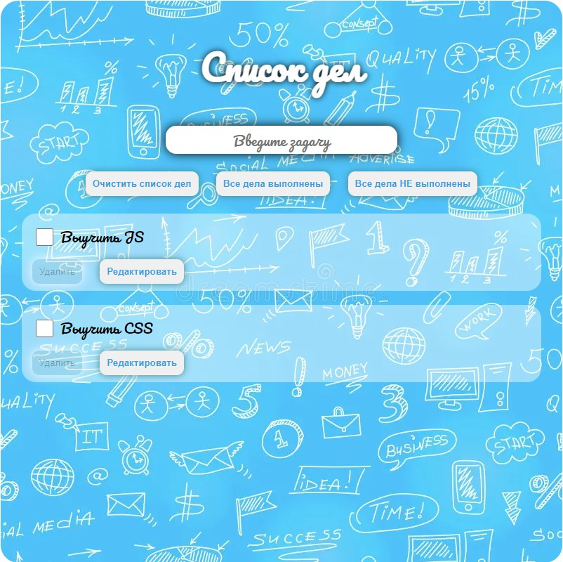
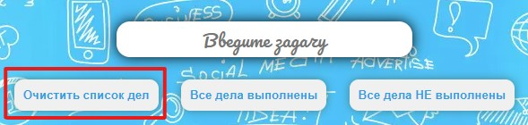

# TodoList 

#### Web-приложение для создания заметок своих дел. В приложении можно записывать свои задачи и помечать их как выполненные. Есть возможность удаления дел после их выполнения, редактирование дел, очистка всего списка дел. Есть возможность пометить все задачи как выполненные или невыполненные.

## Общий вид приложения

## Функционал

- Ввод задачи (Добавление происходит после нажатия клавиши "Enter")
  
    
- Пометка задачи как выполненной (нажатие на checkbox)
  
    
- Удаление конкретной задачи (кнопка "Удалить" под каждой задачей. Возможность удалить задачу появляется только после того как она помечена при помощи checkbox как Выполненная)

    
- Редактирование конкретной задачи (кнопка "Редактировать" под каждой задачей)

    

    После нажатия на кнопку "Редактировать" на месте текста задачи появляется поле ввода с возможнотью редактирования текста задачи.

    По завершению редактирования можно отменить (кнопка "Отмена")

    

    или сохранить (кнопка "Сохранить") внесённые изменения.

    

- Очистка всего списка дел (кнопка "Очистить список дел")

    

- Пометить все задачи как выполненные (кнопка "Все дела выполнены". При этом checkbox на всех задачах станут выделенными)

    

- Пометить все задачи как невыполненные (кнопка "Все дела НЕ выполнены". Выделение на всех checkbox пропадёт)

    

## Стек технологий

- HTML
- CSS
- JavaScript